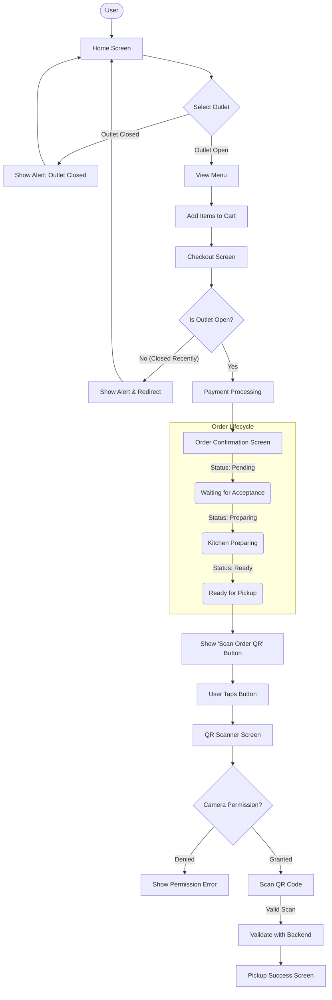

# Zordr Project Architecture & Flow

## User Flow Diagram

This diagram illustrates the core user journey, including the newly implemented **Closed Outlet Handling** and **QR Scanner** features.



## High-Level Architecture

The Zordr ecosystem consists of the Mobile App, Partner App (implied), and the Backend.

```mermaid
graph TB
    subgraph MobileApp ["Mobile App (React Native / Expo)"]
        UI[UI Components]
        Nav[Expo Router]
        Store[StoreContext (Zustand)]

        UI --> Nav
        UI --> Store
        Nav --> Screens

        subgraph Screens
            HomeSc[Home Screen]
            CheckoutSc[Checkout Screen]
            OrderConfSc[Order Confirmation]
            QRSc[QR Scanner]
        end
    end

    subgraph BackendSystem ["Backend (Node.js / Express)"]
        API[API Routes]
        Auth[Middleware (Auth)]
        DB_Adapter[Database Adapter]

        API --> Auth
        Auth --> DB_Adapter
    end

    subgraph DatabaseSystem ["Database (PostgreSQL)"]
        Users
        Orders
        Outlets
        Products
    end

    Store -- "REST API (Axios)" --> API
    DB_Adapter -- "SQL Queries" --> DatabaseSystem
```

## Key Feature Implementation Details

### 1. Closed Outlet Handling

- **Home Screen**: Prevents selection of closed outlets immediately.
- **Checkout Screen**: Re-validates outlet status before fetching time slots to handle cases where an outlet closes while the user is browsing.
- **Backend**: Returns empty slots if the outlet is closed, adding a final layer of validation.

### 2. QR Scanner Flow

- **Entry Point**: `OrderConfirmationScreen` (only visible when Order Status is 'Ready').
- **Technology**: `expo-camera` for camera access and barcode scanning.
- **UX**:
  - Dark overlay with transparent scanning frame.
  - Corner brackets for visual guidance.
  - Haptic feedback on successful scan.

```

```
